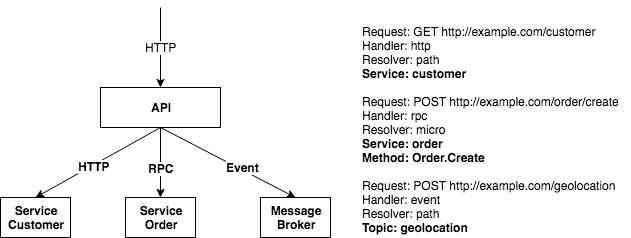

## 概述
**API** 是一个可插拔的 API 接口，由 **Registry** 驱动，可帮助构建强大的公共 API 网关.

**API** 库提供 api 网关路由功能。微服务体系结构将应用程序逻辑分离到单独的服务中. api 网关提供单个入口点，以将这些服务合并到统一 api 中。 **API** 使用在 **Registry** 元数据中定义的路由来生成路由规则并服务 http 请求.

`vine api` 基于 **API**。

## handler
处理程序是用于处理请求的 http 程序。它比使用 http.Handler 模式更方便。

- api - 处理任何 HTTP 请求。通过 RPC 完全控制 http 请求 / 响应。
- broker - 实现 vine 代理接口的 http 处理程序。
- event - 处理任何 HTTP 请求并发布到消息总线。
- http - 处理任何 HTTP 请求，并作为反向代理转发。
- registry - 实现 vine **Registry** 接口的 http 处理程序。
- rpc - 处理 json 和原始 POST 请求。转发为 RPC。
- web - 包含 websocket 支持的 HTTP 处理程序。

## API handler
API 处理程序是默认处理程序。它提供任何 HTTP 请求，并作为具有特定格式的 RPC 请求转发.
- Content-Type：任何
- Body： 任何
- Forward Format: api.Request/api.Response
- Path: /[service]/[method]
- Resolver: 路径用于解析服务和方法的路径

## proxy handler
代理处理程序是一个 http 处理程序，它服务于 vine 代理接口
- Content-Type: 任何
- Body: 任何
- Forward Format: HTTP
- PATH: /
- Resolver: 指定为查询参数的主题

发布请求并将发布

## event handler
事件处理程序使用在消息总线上提供 HTTP 并将请求作为消息转发的 vine/service/client.Publish 发布方法.

- Content-Type: Any
- Body: Any
- Forward Format: 请求格式为 go-api/proto.Event
- Path：/[topic]/[event]
- Resolver: 用于解析主题和事件名称路径

## http handler

http 处理程序是具有内置服务发现的 http 反向代理.

- Content-Type: 任何
- Body: 任何
- Forward Format: HTTP 反向代理
- Path: /[service]
- Resolver: 用于解析服务名称路径

## registry handler
registry handler 是一个 http 处理程序，它为 vine **Registry** 接口提供服务

- Content-Type: 任何
- Body: JSON
- Forward Format: HTTP
- Path: /
- Resolver: 用于获取服务，注册或注销的 GET, POST, DELETE 方法

## rpc handler
rpc handler 为 json 或 protobuf HTTP POST 请求提供服务，并作为 RPC 请求转发.

- Content-Type: application/json 或 application/protobuf
- Body: JSON 或 Protobuf
- Forward Format: 基于内容的 json-rpc 或 proto-rpc
- Path: /[service]/[method]
- Resolver: 用于解析服务和方法路径

## web handler
web handler 是一个 http 反向代理，内置服务发现和 webstock 支持.

- Content-Type: 任何
- Body: 任何
- Forward Format: HTTP 反向代理，包括 websocket
- Path: /[service]
- Resolver: 用于解析服务名称路径

