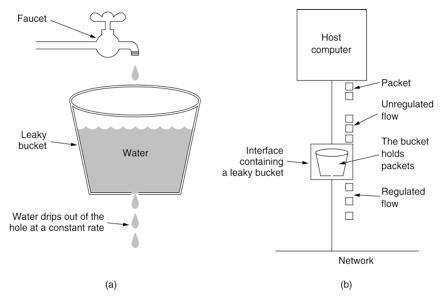
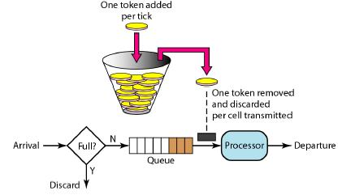

## 简介
缓存、降级和限流是高并发系统时有三把利器。

限流(限制并发/请求量),它的目的是通过对并发访问/请求进行限速或者一个时间窗口内的请求进行限速来保护系统，如果请求达到上限值，服务端可以采取拒接服务、排队或等待、降级。

## 限流算法
常见的限流算法有: 令牌桶、漏桶。

### 漏桶
漏桶(Leaky Bucket)算法思路很简单，水(请求)先进入到漏桶里，漏桶以一定的速度出水(接口有响应速率)，当水流入速度过大会直接溢出(访问频率超过接口响应速率)，然后就拒绝请求，可以看出漏桶算法能强行限制数据的传输速率。


### 令牌桶
令牌桶算法(Token Bucket)和 Leaky Bucket 效果一样但方向相反的算法，更加容易理解。随着时间流逝，系统会按恒定 1/QPS 时间间隔(如果QPS=100,则间隔是10ms)往桶里加入 Token (想象和漏洞漏水相反,有个水龙头在不断的加水)，如果桶已经满了就不再加了。新请求来临时，会各自拿走一个Token，如果没有Token可拿了就阻塞或者拒绝服务。



## 使用
**Vine** 的 wrapper 可以实现限流器功能:
```go
package main

import (
	"context"

	pb "github.com/vine-io/examples/wrapper/pb"
	ub "github.com/vine-io/plugins/wrapper/ratelimiter/uber"
	"github.com/vine-io/vine"
	log "github.com/vine-io/vine/lib/logger"
)

type hello struct{}

func (h hello) Echo(ctx context.Context, request *pb.Request, response *pb.Response) error {
	response.Result = request.Name
	return nil
}

func main() {
	handler := ub.NewHandlerWrapper(1000)

	s := vine.NewService(
		vine.Name("helloworld"),
		vine.WrapHandler(handler),
	)

	s.Init()

	pb.RegisterHelloHandler(s.Server(), &hello{})

	if err := s.Run(); err != nil {
		log.Fatal(err)
	}
}
```
