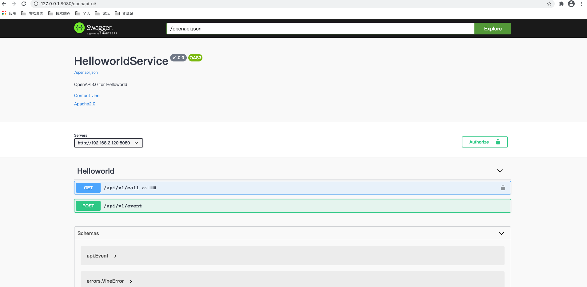

## 概述
*Vine* 内部集成 openapi3.0，`protoc-gen-vine` 通过识别 protobuf 文件的注释生成 Openapi3.0 文档。类似 [Validator](https://vine-io.github.io/vine/docs/tools/validate/)。 

## 使用
### 1.先编写 helloworld.proto 文件
```protobuf
syntax = "proto3";

package testdata;
option go_package = "github.com/vine-io/vine/testdata/proto;testdata";

import "github.com/vine-io/vine/proto/api/api.proto";

// +gen:openapi
// +gen:term_name=vine
// +gen:term_email=598223084@qq.com
// +gen:contact_name=vine
// +gen:contact_email=598223084@qq.com
// +gen:license_name=Apache2.0
// +gen:license_url=https://www.apache.org/licenses/LICENSE-2.0
// +gen:external_doc_desc=123
// +gen:external_doc_url=http://www.baidu.com
service Helloworld {
  // +gen:get=/api/v1/call
  // +gen:body=*
  // +gen:summary=callllllllll
  // +gen:security=bearer, apiKeys, basic
  // +gen:result=[200]
  rpc Call(HelloWorldRequest) returns (HelloWorldResponse) {};
  // +gen:post=/api/v1/event
  // +gen:body=*
  rpc Mul(api.Event) returns (HelloWorldResponse) {};
}

message HelloWorldRequest {
  // +gen:required
  string name = 1;
  int32 age = 2;
}


message HelloWorldResponse {
  int32 code = 1;
  string reply = 2;
}


```
### 2.安装 protoc-gen-vine
```bash
go get github.com/vine-io/vine/cmd/protoc-gen-vine
```

### 3.生成 swagger 文档
```bash
protoc -I=$GOPATH/src -I=$GOPATH/src/github.com/gogo/googleapis --gogofaster_out=plugins=grpc:. --vine_out=:. proto/helloworld.proto
```
执行完成后生成以下代码:
```golang
// Swagger OpenAPI 3.0 for Helloworld service
func NewHelloworldOpenAPI() *registry.OpenAPI {
    // ...
}
```
### 4.验证
生成的 Openapi3.0 文档会自动注册到 `Registry` 组件，当启动 `vine api` 时添加 `--enable-openapi` 参数可以启动 OpenAPI3.0 功能:
```go
vine api --handler=rpc --enable-openapi
```
启动用访问 url `http://127.0.0.1:8080/openapi-ui/` 效果如下:



*Vine* 的 OpenAPI 支持 swagger 风格和 redoc 风格，切换到 redoc 则使用路径 `http://127.0.0.1:8080/openapi-ui/redoc`，效果如下：


## 语法解析
`protoc-gen-vine` 通过解析 `protobuf` 中的注释来生成 OpenAPI3.0 文档。
```protobuf
// +gen:openapi
// +gen:term_name=vine
// +gen:term_email=598223084@qq.com
// +gen:contact_name=vine
// +gen:contact_email=598223084@qq.com
// +gen:license_name=Apache2.0
// +gen:license_url=https://www.apache.org/licenses/LICENSE-2.0
// +gen:external_doc_desc=123
// +gen:external_doc_url=http://www.baidu.com
service Helloworld {
  // +gen:get=/api/v1/call
  // +gen:body=*
  // +gen:summary=callllllllll
  // +gen:security=bearer, apiKeys, basic
  // +gen:result=[200]
  rpc Call(HelloWorldRequest) returns (HelloWorldResponse) {};
  // +gen:post=/api/v1/event
  // +gen:body=*
  rpc Mul(api.Event) returns (HelloWorldResponse) {};
}
```
> 注: `protoc-gen-vine` 和 `protoc-gen-validator` 中存在大量重复注释，这样设计的原因是通过一套的注释规则直接生成更多的代码，较少非业务代码的编写。

### 语法规则
有效的注释有以下的规则:
- 注释必须以 `+gen` 作为开头
- 注释的内容必须紧贴对应的字段，中间不能有空行
- 支持多行注释，也可以将多行合并成一行，并用 `;` 作为分隔符

> 注：// 风格的注释会被识别为 openapi3.0 中的 Description 信息。

### 类型支持
`service` 类型规则:
- openapi（必填）: 生成 openapi 的标识，具有此标识的 Service 才会生成文档
- term_url: 项目团队的 url
- contact_name: 项目作者名称，和 contact_email 配合使用
- contact_email: 项目作者邮箱，和 contact_name 配合使用
- license_name: 项目遵循的许可类型，和 license_url 配合使用
- license_url: 项目遵循的许可 url，和 license_name配合使用
- external_doc_desc: 扩展文档描述，和 external_doc_url 配合使用
- external_doc_url: 扩展文档 url，和 external_doc_url 配合使用
- version: 文档版本，如 1.0.0

```protobuf
// +gen:ignore
message P {
  // +gen:openapi
  // +gen:term_name=vine
  // +gen:term_email=598223084@qq.com
  // +gen:contact_name=vine
  // +gen:contact_email=598223084@qq.com
  // +gen:license_name=Apache2.0
  // +gen:license_url=https://www.apache.org/licenses/LICENSE-2.0
  // +gen:external_doc_desc=123
  // +gen:external_doc_url=http://www.example.com
  service HelloWorld {

  }
}
```
`rpc` 支持的规则:
- get | post | put | patch | delete（必填）: 生成对应的 http method，后面紧接路由信息，如 // +gen:get=/api/v1/call
- body: 指定 Request message 的名称，可以直接使用 `*`
- summary: 接口的摘要信息
- security: 路由支持的 Authorization。支持 beaer, apiKeys 和 basic
- result: http response code。支持 200，400，401，403，404，405，408，409，500，502，503，504

> 注: 使用 +gen:security 时，result 会直接添加 401，403 的内容

`message` 作为内嵌字段时支持的规则:
- required: 判断该字段是否为 nil。

```protobuf
service Helloworld {
  // +gen:get=/api/v1/call
  // +gen:body=*
  // +gen:summary=callllllllll
  // +gen:security=bearer, apiKeys, basic
  // +gen:result=[200]
  rpc Call(HelloWorldRequest) returns (HelloWorldResponse) {};
  // +gen:post=/api/v1/{name}/{id}
  // +gen:body=*
  rpc Mul(api.Event) returns (HelloWorldResponse) {};
}
```

`message` 字段通用的规则：
- required: 指定字段为必填
- default: 指定字段的默认值
- example: 给定字段的实例
- in: 字段只能在几个值中选择
- enum: 同 in
- ro: 字段为只读
- wo: 字段为只写，和 password 配合使用

```protobuf
message HelloWorldRequest {
  // +gen:required
  // +gen:default="hello"
  // +gen:example="hello"
  // +gen:ro
  // +gen:rw
  string name = 1;
  // +gen:enum=[1,2,3]
  int32 age = 2;
}
```

`string` 类型支持的规则
- min_len: 指定字段的最小长度
- max_len: 指定字段的最大长度
- email: 邮箱地址格式
- date: 日期格式[RFC 3339, section 5.6](https://tools.ietf.org/html/rfc3339#section-5.6)，如 2017-07-21
- date-time: 日期加时间格式[RFC 3339, section 5.6](https://tools.ietf.org/html/rfc3339#section-5.6)，如 2017-07-21T17:32:28Z
- password: 密码格式
- byte: 字节格式
- binary: 二进制格式，上传文件使用
- ip: ip 地址格式
- ipv4: ipv4 格式
- ipv6: ipv6 格式
- uuid: uuid v4 格式
- uri: uri 格式
- hostname: 主机名
- pattern: 正则表达式

```protobuf
message S {
    // +gen:required
    // +gen:default="hello"
    // +gen:in=["1", "2", "3"]
    // +gen:enum=["a", "b", "c"]
    // +gen:min_len=3
    // +gen:min_max=4
    // +gen:pattern=`\d+(\w+){3,5}`
    // +gen:password
    // +gen:email
    // +gen:ip
    // +gen:ipv4
    // +gen:ipv6
    // +gen:date
    // +gen:date-time
    // +gen:bytes
    // +gen:binary
    // +gen:hostname
    // +gen:uuid
    // +gen:uri
    string m = 1;
}
```

> 注: string pattern 最好单独一行，以免和其他规则冲突

数字类型的支持，包含 int32, int64, fixed32, fix64, float, double
- lt: 指定字段小于指定值
- lte: 指定字段的小于等于指定值
- gt: 指定字段大于指定值
- gte: 指定字段大于等于指定值

```protobuf
message S {
    // +gen:required
    float a = 1;

    // +gen:default=3.14
    double pi = 2

    // +gen:in=[1,2,3]
    // +gen:enum=[2,3]
    // +gen:not_in=[4,5]
    int32 b = 3;

    // +gen:ge=3
    // +ggen:gte=4
    // +gen:lte=9
    // +gen:lt=10
    int64 c = 4;
}
```


